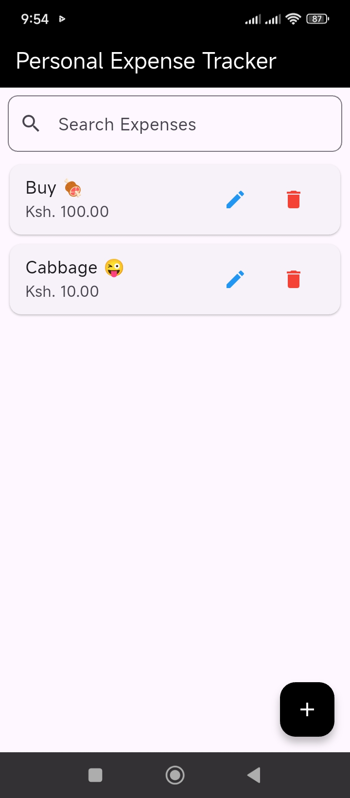
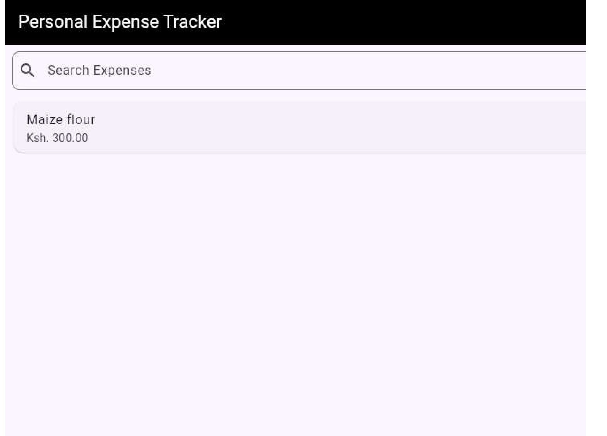

# 💰 Personal Expense Tracker (Flutter)

A sleek and user-friendly **Flutter Expense Tracker** app that helps you record, search, and manage daily expenses — available on **mobile** and **web**.

This project demonstrates clean UI design, persistent local storage using `SharedPreferences`, and responsive layout that adapts beautifully across screen sizes.

---

## 🖼️ Screenshots

### 📱 Mobile View
<p align="center">
  
 
</p>

### 💻 Web View
<p align="center">
  
 
</p>


---

## 🚀 Features

- ✅ Add and manage expenses (title + amount)
- 🔍 Real-time live search filtering
- 💾 Persistent data storage using `SharedPreferences`
- 🧩 Responsive layout for mobile and web
- 🧠 Clean and intuitive Material Design UI
- ⚡ Instant updates using `setState` for simplicity

---

## 🧠 Tech Stack

| Technology | Purpose |
|-------------|----------|
| **Flutter (Dart)** | UI framework for cross-platform development |
| **Material Design** | Modern, accessible user interface |
| **SharedPreferences** | Local storage for saving expenses |
| **Stateful Widgets** | Dynamic updates to UI |
| **Dart JSON Encoding** | Data serialization |

---

## 📁 Folder Structure

```

lib/
├── main.dart            # Entry point
├── widgets/             # (optional) custom widgets
├── models/              # (optional) data structures
└── utils/               # (optional) helpers and constants
screenshots/
├── mobile_home.png
├── mobile_add.png
├── web_home.png
└── web_add.png

````

---

## ⚙️ Installation & Setup

1. **Clone the Repository**
   ```bash
   git clone https://github.com/<your-username>/personal_expense_tracker.git
   cd personal_expense_tracker


2. **Install Dependencies**

   ```bash
   flutter pub get
   ```

3. **Run on Mobile**

   ```bash
   flutter run
   ```

4. **Run on Web**

   ```bash
   flutter run -d chrome
   ```
5. **Download APK**
   <a href link ="https://github.com/AKW254/Personal-Expense-Tracker/blob/main/apk/test_app.apk">Click Here<a/>
---

## 📱 App Overview

The app consists of three key components:

1. **Expense List**
   Displays a list of all stored expenses with titles and amounts.

2. **Live Search Bar**
   Filters expenses instantly as you type.

3. **Add Expense Modal**
   Opens a clean bottom modal form to add a new expense — with smooth keyboard handling.

---

## 💾 Data Persistence

Expenses are stored locally using **SharedPreferences** in JSON format:

```dart
Future<void> _saveExpenses() async {
  final prefs = await SharedPreferences.getInstance();
  final String encodedData = jsonEncode(expenses);
  await prefs.setString('expenses', encodedData);
}
```

The app automatically loads saved data at startup:

```dart
Future<void> _loadExpenses() async {
  final prefs = await SharedPreferences.getInstance();
  final String? encodedData = prefs.getString('expenses');
  if (encodedData != null) {
    setState(() {
      expenses = List<Map<String, dynamic>>.from(jsonDecode(encodedData));
      filteredExpenses = List.from(expenses);
    });
  }
}
```

---

## 🌟 Future Enhancements

* [ ] Expense categories (Food, Transport, Bills, etc.)
* [ ] Monthly charts using `fl_chart`
* [ ] Export reports (PDF/Excel)
* [ ] Cloud sync with Firebase
* [ ] Dark mode toggle

---

## 🧑‍💻 Author

**Antony Kilonzo Wambua**
🎓 B.Sc. in Computer Science (St. Paul’s University)
📧 [kilonzowambua254@gmail.com](mailto:kilonzowambua254@gmail.com)
🌐 [GitHub Profile](https://github.com/AKW254) | [LinkedIn](https://www.linkedin.com/in/antony-wambua-293459265/)

---

## 🪪 License

This project is licensed under the **MIT License** — you’re free to use, modify, and distribute it with attribution.


